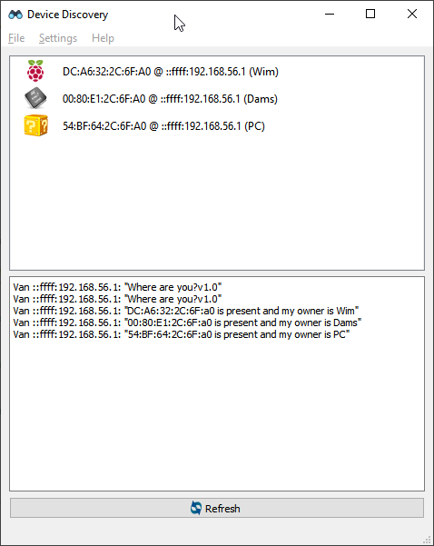

# Device Finder

Small application written in C++/Qt to send an UDP broadcast (port 64000) 

	Where are you?v1.0
	
and listens to an UDP response:

	XX:XX:XX:XX:XX:XX is present and my owner is YYYYYY ZZZZZZ
	


If you want you can test it with ncat (http://nmap.org/dist/ncat-portable-5.59BETA1.zip)
```
ncat -u 127.0.0.1 64000
```
and paste strings like:
```
00:80:E1:00:00:42 is present and my owner is Iron Man
```
or
```
DC:A6:32:00:00:42 is present and my owner is Black Widow
```
or
```
BB:A6:32:00:00:42 is present and my owner is Super Mario
```
